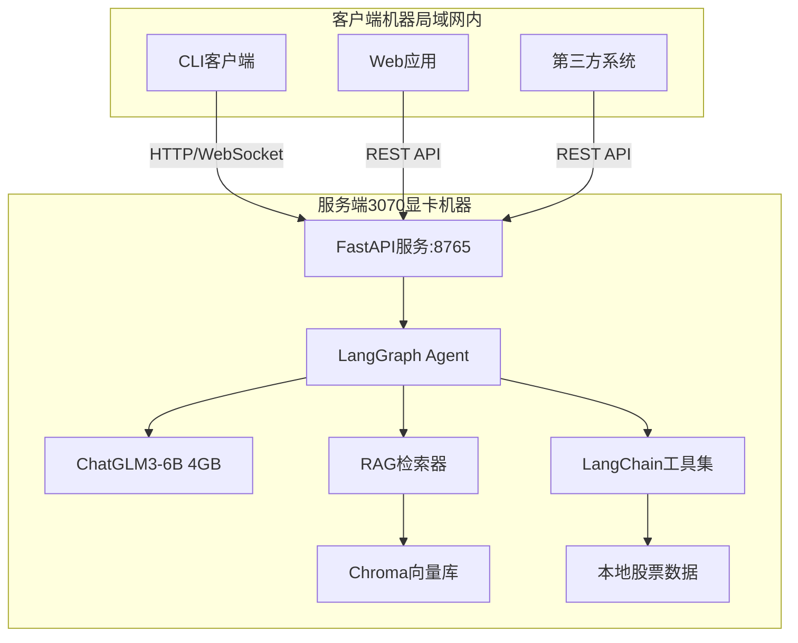
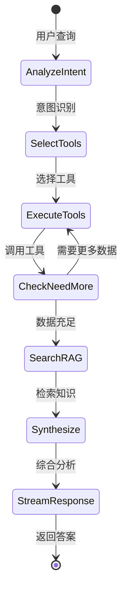

# 股票咨询Agent系统完整实施方案

> **项目概述**：基于本地LLM的股票咨询Agent系统，采用服务端-客户端架构。使用LangGraph框架，ChatGLM3-6B模型（4GB显存），集成RAG知识库和真实历史股票数据。Agent在3070显卡机器上作为HTTP服务（端口8765）运行，局域网内其他机器通过CLI或API访问。

---

## 整体架构



## 核心技术栈确定

### 1. LLM模型：ChatGLM3-6B INT4

**选择理由**：
- 显存占用：**4GB**（留4GB给并发、向量模型、系统）
- 推理速度：15-20 tokens/s（3070）
- 中文理解能力强，适合金融领域
- 支持工具调用（通过提示词工程）
- 社区成熟，文档完善

**备选**：Qwen2-1.5B-Instruct AWQ（如需更高并发）

**加载方式**：
```python
from transformers import AutoTokenizer, AutoModel

tokenizer = AutoTokenizer.from_pretrained("THUDM/chatglm3-6b", trust_remote_code=True)
model = AutoModel.from_pretrained("THUDM/chatglm3-6b", trust_remote_code=True).quantize(4).cuda()
model = model.eval()
```

### 2. Agent框架：LangGraph + LangChain

**核心依赖**：
```txt
langchain>=0.1.0
langgraph>=0.0.20
langchain-community
langchain-core
```

**Agent工作流（LangGraph状态图）**：



**实现示例**：
```python
from langgraph.graph import StateGraph, END
from langchain.agents import Tool
from langchain_community.chat_models import ChatGLM

# 定义状态
class AgentState(TypedDict):
    query: str
    tools_called: List[str]
    tool_results: Dict
    knowledge: str
    answer: str

# 构建图
workflow = StateGraph(AgentState)
workflow.add_node("analyze", analyze_query)
workflow.add_node("call_tools", execute_tools)
workflow.add_node("search_rag", search_knowledge)
workflow.add_node("generate", generate_answer)

workflow.add_edge("analyze", "call_tools")
workflow.add_edge("call_tools", "search_rag")
workflow.add_edge("search_rag", "generate")
workflow.add_edge("generate", END)

agent = workflow.compile()
```

### 3. RAG系统

**向量模型**：`bge-small-zh-v1.5`（小而精）
- 显存占用：<500MB
- 适合中文金融文本

**向量数据库**：Chroma（本地部署）

**知识库数据来源**：

| 类型 | 来源 | 数量 | 获取方式 |
|------|------|------|---------|
| 金融术语 | 百度百科API | 1000+条 | 提供爬虫脚本 |
| 基础知识 | 手工编写 | 50个markdown文件 | 项目内置 |
| A股规则 | 证监会官网 | 20+PDF | 提供解析脚本 |
| 技术分析 | 开源教材 | 10章节 | 项目内置 |
| FAQ | 手工编写 | 100+对 | 项目内置 |

**项目提供**：
- `data/knowledge/` 预置知识库（800KB markdown文件）
- `scripts/crawl_finance_terms.py` 爬取金融术语
- `scripts/build_vectordb.py` 构建向量数据库

### 4. 工具集：基于真实历史数据

**数据源**：akshare（开源免费）

**预置数据**：
```python
# 50只热门股票的历史数据（2020-2024）
stocks = [
    '贵州茅台', '比亚迪', '宁德时代', '中国平安', '招商银行',
    '五粮液', '隆基绿能', '药明康德', '迈瑞医疗', '京东方A',
    # ... 共50只
]
```

**工具定义**（LangChain格式）：

```python
from langchain.tools import StructuredTool

tools = [
    StructuredTool.from_function(
        func=get_stock_price,
        name="get_stock_price",
        description="获取股票的历史价格数据。输入：股票名称或代码，时间周期（1week/1month/3month/1year）。返回：开高低收价格和成交量"
    ),
    StructuredTool.from_function(
        func=get_financial_indicators,
        name="get_financial_indicators",
        description="获取股票的财务指标。输入：股票名称。返回：市盈率、市净率、ROE、负债率等"
    ),
    StructuredTool.from_function(
        func=calculate_technical_indicators,
        name="calculate_technical_indicators",
        description="计算技术指标。输入：股票名称，指标类型（MA/MACD/RSI/BOLL）。返回：技术指标数值和建议"
    ),
    StructuredTool.from_function(
        func=search_stock_news,
        name="search_stock_news",
        description="搜索股票相关新闻。输入：股票名称，时间范围。返回：新闻摘要列表"
    ),
    StructuredTool.from_function(
        func=compare_stocks,
        name="compare_stocks",
        description="对比多只股票。输入：股票列表（逗号分隔）。返回：对比分析表格"
    ),
]
```

**项目提供**：
- `data/stocks/` 预下载50只股票数据（parquet格式，~20MB）
- `scripts/download_stock_data.py` 批量下载脚本（akshare）
- `src/data/stock_data_loader.py` 数据加载和缓存

### 5. FastAPI服务（端口8765）

**核心端点**：

```python
# POST /api/v1/query - 非流式查询
# POST /api/v1/chat/stream - 流式查询（SSE）
# WebSocket /ws/chat - WebSocket流式
# POST /api/v1/session/create - 创建会话
# GET /api/v1/session/{id} - 获取会话历史
# GET /api/health - 健康检查
# GET /api/metrics - Prometheus指标
```

**并发策略**：
- 请求队列 + 信号量（最多3个并发）
- 超时设置：60秒
- 排队最多10个请求

**认证**：简单Token认证
```python
headers = {"Authorization": "Bearer your-secret-token"}
```

### 6. CLI客户端

**安装**：
```bash
pip install ./client
stock-agent config --server http://192.168.1.100:8765 --token xxx
```

**使用**：
```bash
# 交互式对话
stock-agent chat

# 单次查询
stock-agent query "比亚迪怎么样？"

# 批量分析
stock-agent batch stocks.txt -o report.md
```

**技术栈**：
- `httpx` + `websockets`：网络通信
- `rich`：终端美化
- `typer`：CLI框架

## 项目文件结构

```
agent/
├── server/                           # 服务端（3070机器）
│   ├── src/
│   │   ├── api/
│   │   │   ├── main.py              # FastAPI入口
│   │   │   ├── endpoints.py         # API端点
│   │   │   ├── websocket.py         # WebSocket处理
│   │   │   └── auth.py              # Token认证
│   │   ├── agent/
│   │   │   ├── graph.py             # LangGraph工作流
│   │   │   ├── nodes.py             # 图节点实现
│   │   │   ├── tools.py             # LangChain工具定义
│   │   │   └── prompts.py           # 提示词模板
│   │   ├── llm/
│   │   │   ├── chatglm_loader.py    # ChatGLM3加载
│   │   │   └── inference.py         # 异步推理封装
│   │   ├── rag/
│   │   │   ├── vectorstore.py       # Chroma封装
│   │   │   ├── embeddings.py        # bge-small-zh
│   │   │   └── retriever.py         # 混合检索
│   │   └── data/
│   │       ├── stock_loader.py      # 股票数据加载
│   │       ├── stock_analyzer.py    # 技术指标计算
│   │       └── cache.py             # Redis缓存
│   ├── configs/
│   │   ├── server_config.yaml       # 服务配置（端口8765）
│   │   └── model_config.yaml        # 模型配置
│   ├── requirements.txt
│   └── start_server.py
│
├── client/                           # 客户端（其他机器）
│   ├── src/
│   │   ├── cli/
│   │   │   ├── main.py              # CLI入口
│   │   │   └── commands.py          # 命令实现
│   │   └── api_client/
│   │       ├── http_client.py       # HTTP客户端
│   │       └── ws_client.py         # WebSocket客户端
│   ├── requirements.txt
│   └── setup.py
│
├── data/                             # 数据文件
│   ├── knowledge/                    # RAG知识库
│   │   ├── basics/                  # 基础知识（预置）
│   │   ├── terms/                   # 金融术语（预置）
│   │   └── faq/                     # 常见问答（预置）
│   ├── stocks/                       # 股票历史数据
│   │   ├── 贵州茅台.parquet
│   │   ├── 比亚迪.parquet
│   │   └── ...                      # 50只股票
│   └── vector_db/                    # 向量数据库（需构建）
│
├── scripts/                          # 工具脚本
│   ├── download_stock_data.py       # 下载股票数据（akshare）
│   ├── crawl_finance_terms.py       # 爬取金融术语
│   ├── build_vectordb.py            # 构建向量数据库
│   └── import_knowledge.py          # 导入知识文档
│
├── tests/                            # 测试模块
│   ├── unit/
│   │   ├── test_tools.py            # 工具单元测试
│   │   ├── test_data_loader.py      # 数据加载测试
│   │   └── test_rag.py              # RAG检索测试
│   ├── integration/
│   │   ├── test_agent_workflow.py   # Agent流程测试
│   │   └── test_langraph.py         # LangGraph测试
│   ├── api/
│   │   └── test_endpoints.py        # API测试
│   ├── load/
│   │   └── locustfile.py            # 压力测试
│   └── fixtures/
│       ├── mock_llm_responses.json  # Mock LLM响应
│       └── test_queries.txt         # 测试查询集
│
├── deploy/                           # 部署相关
│   ├── docker/
│   │   ├── Dockerfile
│   │   └── docker-compose.yml
│   └── scripts/
│       ├── install_windows.ps1      # Windows安装脚本
│       └── install_linux.sh         # Linux安装脚本
│
├── docs/                             # 文档
│   ├── DEPLOYMENT.md                # 部署指南
│   ├── API.md                       # API文档
│   └── DEVELOPMENT.md               # 开发指南
│
├── .github/
│   └── workflows/
│       └── test.yml                 # CI测试
│
├── requirements.txt                  # 总依赖
├── README.md
└── .env.example                      # 环境变量示例
```

## 迁移部署方案

### 方式1：Docker镜像（推荐）

```bash
# 开发机器打包
cd agent/deploy/docker
docker build -t stock-agent:v1 .
docker save stock-agent:v1 | gzip > stock-agent-v1.tar.gz

# 传输到目标机器（U盘/局域网）
# 目标机器加载
gunzip -c stock-agent-v1.tar.gz | docker load
docker-compose up -d
```

**Dockerfile**：
```dockerfile
FROM nvidia/cuda:11.8.0-runtime-ubuntu22.04
WORKDIR /app

# 复制模型和数据（避免下载）
COPY models/ /app/models/
COPY data/ /app/data/
COPY server/ /app/server/

RUN pip install -r server/requirements.txt
EXPOSE 8765

CMD ["python", "server/start_server.py"]
```

### 方式2：Conda环境

```bash
# 开发机器
conda env export > environment.yml
tar -czf agent-full.tar.gz agent/ environment.yml

# 目标机器
tar -xzf agent-full.tar.gz
conda env create -f environment.yml
conda activate stock-agent
python server/start_server.py
```

### 方式3：一键安装脚本

**Windows PowerShell**：
```powershell
# deploy/scripts/install_windows.ps1
.\install_windows.ps1 -ServerIP 192.168.1.100 -Port 8765

# 自动完成：
# 1. 检查CUDA驱动
# 2. 创建Python虚拟环境
# 3. 安装依赖
# 4. 配置防火墙端口8765
# 5. 注册为Windows服务（可选）
# 6. 启动服务
```

**Linux Bash**：
```bash
# deploy/scripts/install_linux.sh
sudo ./install_linux.sh --port 8765

# 自动完成：
# 1-6 同上
# 7. 创建systemd服务
# 8. 设置开机自启
```

## 测试体系

### 1. 单元测试（pytest）

```bash
pytest tests/unit/ -v --cov=server/src --cov-report=html
```

**覆盖范围**：
- 每个工具函数（get_stock_price等）
- 数据加载器
- 技术指标计算
- RAG检索逻辑

### 2. 集成测试

```python
# tests/integration/test_agent_workflow.py
async def test_stock_query_full_flow():
    """测试完整查询流程"""
    agent = create_agent()
    result = await agent.ainvoke({"query": "比亚迪股票分析"})
    
    assert "比亚迪" in result["answer"]
    assert len(result["tools_called"]) >= 2  # 至少调用2个工具
    assert result["knowledge"] != ""  # 有RAG检索
```

### 3. API测试

```python
# tests/api/test_endpoints.py
def test_query_endpoint():
    response = client.post("/api/v1/query",
        headers={"Authorization": "Bearer test-token"},
        json={"query": "茅台分析"})
    
    assert response.status_code == 200
    data = response.json()
    assert "answer" in data
    assert data["session_id"] is not None
```

### 4. 压力测试（Locust）

```bash
# 模拟10个并发用户
locust -f tests/load/locustfile.py --users 10 --spawn-rate 2 --host http://localhost:8765
```

### 5. 测试数据

**项目提供**：
- `tests/fixtures/mock_llm_responses.json` - 预设LLM响应（加速测试）
- `tests/fixtures/test_queries.txt` - 50+典型查询
- `tests/fixtures/expected_results.json` - 预期结果

### 测试命令

```bash
# 运行所有测试
pytest tests/ -v

# 只运行单元测试
pytest tests/unit/

# 生成覆盖率报告
pytest --cov=server/src --cov-report=html

# 运行压力测试
locust -f tests/load/locustfile.py
```

## 配置文件示例

**server/configs/server_config.yaml**：
```yaml
server:
  host: "0.0.0.0"
  port: 8765
  workers: 1
  
auth:
  enabled: true
  token: "change-me-in-production"

queue:
  max_concurrent: 3
  max_queue_size: 10
  timeout: 60

model:
  name: "chatglm3-6b"
  quantization: "int4"
  device: "cuda"
  max_length: 4096

rag:
  enabled: true
  top_k: 5
  score_threshold: 0.7

data:
  stock_data_path: "./data/stocks"
  knowledge_path: "./data/knowledge"
  vector_db_path: "./data/vector_db"
```

## 性能预估（3070 + ChatGLM3-6B）

| 指标 | 预期值 |
|------|--------|
| 模型加载时间 | 15-20秒 |
| 首Token延迟（TTFT） | 0.8-1.5秒 |
| 生成速度 | 15-20 tokens/s |
| 同时在线用户 | 3-4人流畅 |
| 最大排队数 | 10人 |
| 单次查询平均时间 | 8-15秒 |
| 显存占用 | 4.5-5.5GB |

## 监控和日志

**日志系统**：
```python
# 结构化日志
import structlog

log = structlog.get_logger()
log.info("query_received", 
         query=query, 
         session_id=session_id,
         queue_length=queue.size())
```

**监控指标**（Prometheus格式）：
- 请求数/分钟
- 平均响应时间
- P95/P99延迟
- GPU利用率
- 显存使用量
- 队列长度
- 错误率

**访问方式**：
```bash
curl http://localhost:8765/api/metrics
```

## 开发流程

### Phase 1：基础搭建（第1-2周）
1. 环境配置和依赖安装
2. ChatGLM3模型加载和测试
3. 基本的FastAPI服务框架

### Phase 2：核心功能（第3-4周）
4. 实现5个股票工具（基于akshare数据）
5. 构建RAG知识库
6. LangGraph Agent开发

### Phase 3：服务化（第5周）
7. API端点实现（流式/非流式）
8. CLI客户端开发
9. 并发和队列管理

### Phase 4：测试和部署（第6周）
10. 编写测试用例
11. Docker打包
12. 部署文档编写

---

**计划创建时间**：2026-01-21  
**预计总工期**：6周  
**当前状态**：待开始
